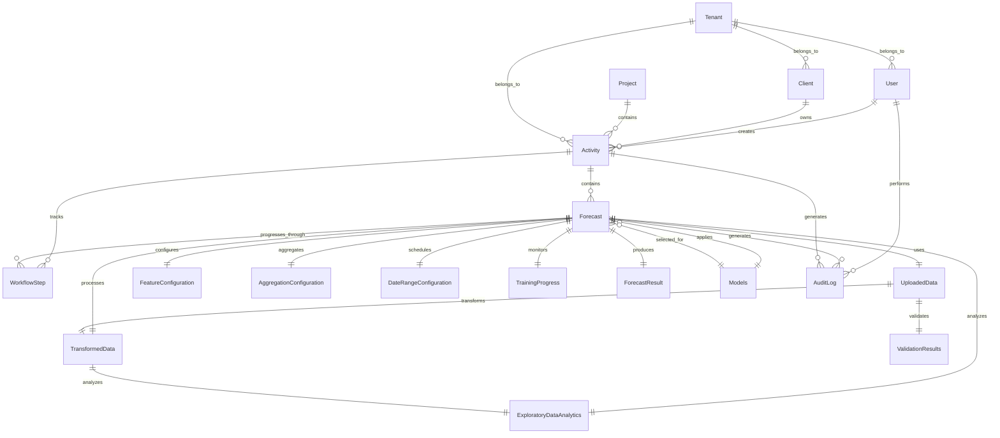

# Dynamic Forecasting Service - Entity Relationships Documentation

## Overview

This document provides comprehensive relationship specifications for the Dynamic Forecasting Service entities, including JPA annotations, cascade strategies, fetch types, and optimization considerations for multi-tenant SaaS architecture.

## Relationship Design Principles

1. **Performance First**: Lazy loading by default, eager only when necessary
2. **Referential Integrity**: Proper cascade and orphan removal strategies  
3. **Multi-Tenancy**: All relationships respect tenant boundaries
4. **Audit Trail**: Maintain relationship history for compliance
5. **Global Scale**: Optimized for distributed architecture

---

## Visual Entity Relationship Diagram



---

## Detailed Relationship Specifications

### Core Forecasting Relationships

#### User → Activity (One-to-Many)
**Source Entity**: User (existing entity from common library)
**Target Entity**: Activity

```java
// In User entity (if extending)
@OneToMany(mappedBy = "createdByUser", cascade = CascadeType.DETACH, fetch = FetchType.LAZY)
private List<Activity> createdActivities;

// In Activity entity
@ManyToOne(fetch = FetchType.LAZY)
@JoinColumn(name = "created_by_user_id", nullable = false)
private User createdByUser;
```

**Cascade Strategy**: CascadeType.DETACH (preserve activities if user deactivated)
**Fetch Strategy**: LAZY (performance optimization)
**Business Rule**: User must exist and be active to create activities
**Query Optimization**: Index on (created_by_user_id, tenant_id)

#### Client → Activity (One-to-Many)
**Source Entity**: Client (existing entity from common library)
**Target Entity**: Activity

```java
// In Client entity (if extending)
@OneToMany(mappedBy = "client", cascade = CascadeType.DETACH, fetch = FetchType.LAZY)
private List<Activity> activities;

// In Activity entity
@ManyToOne(fetch = FetchType.LAZY)
@JoinColumn(name = "client_id", nullable = false)
private Client client;
```

**Cascade Strategy**: CascadeType.DETACH (preserve activities if client relationship changes)
**Fetch Strategy**: LAZY
**Business Rule**: Client must be active and belong to same tenant
**Foreign Key Constraint**: client_id references client.id
**Index Strategy**: (client_id, tenant_id), (client_id, status)

#### Project → Activity (One-to-Many)
**Source Entity**: Project (new entity, follows ClientProject pattern)
**Target Entity**: Activity

```java
// In Project entity
@OneToMany(mappedBy = "project", cascade = CascadeType.DETACH, fetch = FetchType.LAZY)
private List<Activity> activities;

// In Activity entity
@ManyToOne(fetch = FetchType.LAZY)
@JoinColumn(name = "project_id", nullable = false)
private Project project;
```

**Cascade Strategy**: CascadeType.DETACH
**Fetch Strategy**: LAZY
**Business Rule**: Project must belong to same client and tenant
**Validation**: Custom validator ensures client-project consistency

#### Activity → Forecast (One-to-Many)
**Source Entity**: Activity
**Target Entity**: Forecast

```java
// In Activity entity
@OneToMany(mappedBy = "activity", cascade = CascadeType.ALL, fetch = FetchType.LAZY, orphanRemoval = true)
@OrderBy("version DESC")
private List<Forecast> forecasts = new ArrayList<>();

// In Forecast entity
@ManyToOne(fetch = FetchType.LAZY)
@JoinColumn(name = "activity_id", nullable = false)
private Activity activity;
```

**Cascade Strategy**: CascadeType.ALL (complete lifecycle management)
**Fetch Strategy**: LAZY with pagination for large lists
**Orphan Removal**: true (forecasts cannot exist without activity)
**Ordering**: Latest version first
**Business Rule**: Forecast inherits tenant from activity
**Performance**: Batch loading with @BatchSize(size = 20)

### Data Processing Chain Relationships

#### Forecast → UploadedData (One-to-One)
**Source Entity**: Forecast
**Target Entity**: UploadedData

```java
// In Forecast entity
@OneToOne(cascade = CascadeType.ALL, fetch = FetchType.LAZY, orphanRemoval = true)
@JoinColumn(name = "uploaded_data_id", unique = true)
private UploadedData uploadedData;

// In UploadedData entity
@OneToOne(mappedBy = "uploadedData", fetch = FetchType.LAZY)
private Forecast forecast;
```

**Cascade Strategy**: CascadeType.ALL (complete lifecycle)
**Fetch Strategy**: LAZY (data loaded on demand)
**Orphan Removal**: true (uploaded data specific to forecast)
**Unique Constraint**: uploaded_data_id
**File Cleanup**: Custom lifecycle callback for file deletion

#### UploadedData → ValidationResults (One-to-One)
**Source Entity**: UploadedData
**Target Entity**: ValidationResults

```java
// In UploadedData entity
@OneToOne(cascade = CascadeType.ALL, fetch = FetchType.LAZY, orphanRemoval = true)
@JoinColumn(name = "validation_results_id", unique = true)
private ValidationResults validationResults;

// In ValidationResults entity
@OneToOne(mappedBy = "validationResults", fetch = FetchType.LAZY)
private UploadedData uploadedData;
```

**Cascade Strategy**: CascadeType.ALL
**Fetch Strategy**: LAZY (validation results loaded when needed)
**Lifecycle**: Created immediately after file upload

#### UploadedData → TransformedData (One-to-One)
**Source Entity**: UploadedData
**Target Entity**: TransformedData

```java
// In UploadedData entity
@OneToOne(cascade = CascadeType.ALL, fetch = FetchType.LAZY, orphanRemoval = true)
@JoinColumn(name = "transformed_data_id", unique = true)
private TransformedData transformedData;

// In TransformedData entity
@OneToOne(fetch = FetchType.LAZY)
@JoinColumn(name = "original_data_id", nullable = false)
private UploadedData originalData;
```

**Cascade Strategy**: CascadeType.ALL
**Processing Pipeline**: Created during Step 2 (Data Analysis)
**Data Retention**: Linked to parent data retention policy

#### TransformedData → ExploratoryDataAnalytics (One-to-One)
**Source Entity**: TransformedData
**Target Entity**: ExploratoryDataAnalytics

```java
// In TransformedData entity
@OneToOne(cascade = CascadeType.ALL, fetch = FetchType.LAZY, orphanRemoval = true)
@JoinColumn(name = "exploratory_analytics_id", unique = true)
private ExploratoryDataAnalytics exploratoryAnalytics;

// In ExploratoryDataAnalytics entity
@OneToOne(fetch = FetchType.LAZY)
@JoinColumn(name = "transformed_data_id", nullable = false)
private TransformedData transformedData;
```

**Cascade Strategy**: CascadeType.ALL
**Processing**: Generated during EDA phase
**Caching**: Results cached for 24 hours for performance

### Configuration Relationships

#### Forecast → FeatureConfiguration (One-to-One)
**Source Entity**: Forecast
**Target Entity**: FeatureConfiguration

```java
// In Forecast entity
@OneToOne(cascade = CascadeType.ALL, fetch = FetchType.LAZY, orphanRemoval = true)
@JoinColumn(name = "feature_config_id", unique = true)
private FeatureConfiguration featureConfiguration;

// In FeatureConfiguration entity
@OneToOne(mappedBy = "featureConfiguration", fetch = FetchType.LAZY)
private Forecast forecast;
```

**Cascade Strategy**: CascadeType.ALL (configuration specific to forecast)
**Step Dependency**: Created in Step 4 (Feature Selection)
**Validation**: Minimum feature count validation

#### Forecast → AggregationConfiguration (One-to-One)
**Source Entity**: Forecast
**Target Entity**: AggregationConfiguration

```java
// In Forecast entity
@OneToOne(cascade = CascadeType.ALL, fetch = FetchType.LAZY, orphanRemoval = true)
@JoinColumn(name = "aggregation_config_id", unique = true)
private AggregationConfiguration aggregationConfiguration;

// In AggregationConfiguration entity
@OneToOne(mappedBy = "aggregationConfiguration", fetch = FetchType.LAZY)
private Forecast forecast;
```

**Cascade Strategy**: CascadeType.ALL
**Step Dependency**: Created in Step 5 (Aggregation)
**Business Constraints**: SKU/Depot limits enforced

#### Forecast → DateRangeConfiguration (One-to-One)
**Source Entity**: Forecast
**Target Entity**: DateRangeConfiguration

```java
// In Forecast entity
@OneToOne(cascade = CascadeType.ALL, fetch = FetchType.LAZY, orphanRemoval = true)
@JoinColumn(name = "date_range_config_id", unique = true)
private DateRangeConfiguration dateRangeConfiguration;

// In DateRangeConfiguration entity
@OneToOne(mappedBy = "dateRangeConfiguration", fetch = FetchType.LAZY)
private Forecast forecast;
```

**Cascade Strategy**: CascadeType.ALL
**Step Dependency**: Created in Step 6 (Date Ranges)
**Validation**: Training period must precede testing period

### Model and Training Relationships

#### Models → Forecast (One-to-Many)
**Source Entity**: Models (system entity)
**Target Entity**: Forecast

```java
// In Models entity
@OneToMany(mappedBy = "model", cascade = CascadeType.DETACH, fetch = FetchType.LAZY)
private List<Forecast> forecasts = new ArrayList<>();

// In Forecast entity
@ManyToOne(fetch = FetchType.LAZY)
@JoinColumn(name = "model_id", nullable = true)
private Models model;
```

**Cascade Strategy**: CascadeType.DETACH (preserve forecasts if model deactivated)
**Fetch Strategy**: LAZY
**Business Rule**: Model must be active for selection
**Null Handling**: Nullable until Step 3 (Model Selection)

#### Forecast → TrainingProgress (One-to-One)
**Source Entity**: Forecast
**Target Entity**: TrainingProgress

```java
// In Forecast entity
@OneToOne(cascade = CascadeType.ALL, fetch = FetchType.LAZY, orphanRemoval = true)
@JoinColumn(name = "training_progress_id", unique = true)
private TrainingProgress trainingProgress;

// In TrainingProgress entity
@OneToOne(fetch = FetchType.LAZY)
@JoinColumn(name = "forecast_id", nullable = false)
private Forecast forecast;
```

**Cascade Strategy**: CascadeType.ALL
**Real-time Updates**: WebSocket integration for live updates
**Lifecycle**: Created when training starts (Step 7)
**Cleanup**: Removed after training completion or failure

### Results and Analysis Relationships

#### Forecast → ForecastResult (One-to-One)
**Source Entity**: Forecast
**Target Entity**: ForecastResult

```java
// In Forecast entity
@OneToOne(cascade = CascadeType.ALL, fetch = FetchType.LAZY, orphanRemoval = true)
@JoinColumn(name = "forecast_result_id", unique = true)
private ForecastResult forecastResult;

// In ForecastResult entity
@OneToOne(fetch = FetchType.LAZY)
@JoinColumn(name = "forecast_id", nullable = false)
private Forecast forecast;
```

**Cascade Strategy**: CascadeType.ALL
**Creation**: Generated upon training completion (Step 8)
**Performance**: Large JSON fields with selective loading
**Retention**: Configurable retention policy

### Workflow and Audit Relationships

#### Forecast → WorkflowStep (One-to-Many)
**Source Entity**: Forecast
**Target Entity**: WorkflowStep

```java
// In Forecast entity
@OneToMany(mappedBy = "forecast", cascade = CascadeType.ALL, fetch = FetchType.LAZY, orphanRemoval = true)
@OrderBy("stepNumber ASC")
private List<WorkflowStep> workflowSteps = new ArrayList<>();

// In WorkflowStep entity
@ManyToOne(fetch = FetchType.LAZY)
@JoinColumn(name = "forecast_id", nullable = false)
private Forecast forecast;
```

**Cascade Strategy**: CascadeType.ALL
**Ordering**: By step number (1-8)
**Initialization**: All 8 steps created when forecast starts
**State Management**: Steps track completion and validation status

#### User → AuditLog (One-to-Many)
**Source Entity**: User (existing entity)
**Target Entity**: AuditLog

```java
// In User entity (if extending)
@OneToMany(mappedBy = "user", cascade = CascadeType.DETACH, fetch = FetchType.LAZY)
private List<AuditLog> auditLogs;

// In AuditLog entity
@ManyToOne(fetch = FetchType.LAZY)
@JoinColumn(name = "user_id", nullable = false)
private User user;
```

**Cascade Strategy**: CascadeType.DETACH (preserve audit trail)
**Retention Policy**: Based on compliance requirements
**Performance**: Partitioned by date for performance

---

## Integration Points with Existing Entities

### User Management Integration

#### User Entity Extensions
```java
// Extend existing User entity for forecasting relationships
@Entity
@Table(name = "users")
public class User extends AbstractTenancyDomain {
    // Existing fields from common library...
    
    // Additional forecasting relationships
    @OneToMany(mappedBy = "createdByUser", cascade = CascadeType.DETACH, fetch = FetchType.LAZY)
    private List<Activity> createdActivities = new ArrayList<>();
    
    @OneToMany(mappedBy = "user", cascade = CascadeType.DETACH, fetch = FetchType.LAZY)
    private List<AuditLog> auditLogs = new ArrayList<>();
}
```

#### Client Entity Extensions
```java
// Extend existing Client entity for forecasting relationships
@Entity
@Table(name = "client")
public class Client extends AbstractTenancyDomain {
    // Existing fields from common library...
    
    // Additional forecasting relationships
    @OneToMany(mappedBy = "client", cascade = CascadeType.DETACH, fetch = FetchType.LAZY)
    private List<Activity> activities = new ArrayList<>();
    
    @OneToMany(mappedBy = "client", cascade = CascadeType.DETACH, fetch = FetchType.LAZY)
    private List<Project> projects = new ArrayList<>();
}
```

#### Project Entity (New, Following ClientProject Pattern)
```java
@Entity
@Table(name = "project")
public class Project extends AbstractTenancyDomain {
    @Id
    @GeneratedValue(strategy = GenerationType.IDENTITY)
    private Long id;
    
    @Column(nullable = false)
    @NotBlank
    @Size(max = 100)
    private String projectName;
    
    @Enumerated(EnumType.STRING)
    private ProjectType projectType; // Similar to ClientProjectType
    
    @ManyToOne(fetch = FetchType.LAZY)
    @JoinColumn(name = "client_id", nullable = false)
    private Client client;
    
    @OneToMany(mappedBy = "project", cascade = CascadeType.DETACH, fetch = FetchType.LAZY)
    private List<Activity> activities = new ArrayList<>();
    
    // Standard fields...
    private String primaryContactName;
    private String primaryContactNumber;
    private String primaryEmailId;
    
    @Enumerated(EnumType.STRING)
    private Status status;
}
```

### Tenant Isolation Implementation

#### Tenant-Aware Relationships
```java
// Example of tenant-aware query
@Query("SELECT a FROM Activity a WHERE a.client.id = :clientId AND a.tenantId = :tenantId")
List<Activity> findByClientAndTenant(@Param("clientId") Long clientId, @Param("tenantId") Integer tenantId);

// Automatic tenant filtering with Hibernate @TenantId
@Entity
public class Activity extends AbstractTenancyDomain {
    @TenantId
    @Column(name = "tenant_id")
    private Integer tenantId;
    
    // Relationships automatically filtered by tenant context
}
```

---

## Query Optimization Strategies

### N+1 Query Prevention

#### Batch Loading Configuration
```java
// In entity classes
@BatchSize(size = 20)
@OneToMany(mappedBy = "activity", fetch = FetchType.LAZY)
private List<Forecast> forecasts;

// In repository methods
@Query("SELECT DISTINCT a FROM Activity a LEFT JOIN FETCH a.forecasts WHERE a.id IN :ids")
List<Activity> findByIdsWithForecasts(@Param("ids") List<Long> ids);
```

#### Entity Graphs for Complex Fetching
```java
@NamedEntityGraphs({
    @NamedEntityGraph(
        name = "Activity.withForecastsAndResults",
        attributeNodes = {
            @NamedAttributeNode("forecasts"),
            @NamedAttributeNode(value = "forecasts", subgraph = "forecast.results")
        },
        subgraphs = {
            @NamedSubgraph(
                name = "forecast.results",
                attributeNodes = @NamedAttributeNode("forecastResult")
            )
        }
    )
})
```

### Common Query Patterns

#### Dashboard Statistics Queries
```java
// Optimized query for dashboard statistics
@Query("""
    SELECT NEW com.example.dto.DashboardStats(
        COUNT(DISTINCT a.id),
        COUNT(DISTINCT f.id),
        COUNT(DISTINCT CASE WHEN a.status = 'ACTIVE' THEN a.id END),
        COUNT(DISTINCT a.client.id)
    )
    FROM Activity a 
    LEFT JOIN a.forecasts f 
    WHERE a.tenantId = :tenantId
""")
DashboardStats getDashboardStats(@Param("tenantId") Integer tenantId);
```

#### Activity List with Pagination
```java
@Query("""
    SELECT a FROM Activity a 
    LEFT JOIN FETCH a.client c 
    LEFT JOIN FETCH a.project p 
    WHERE a.tenantId = :tenantId 
    AND (:status IS NULL OR a.status = :status)
    AND (:clientId IS NULL OR a.client.id = :clientId)
    ORDER BY a.lastModified DESC
""")
Page<Activity> findActivitiesWithDetails(
    @Param("tenantId") Integer tenantId,
    @Param("status") ActivityStatus status,
    @Param("clientId") Long clientId,
    Pageable pageable
);
```

### Search and Filter Requirements

#### Full-Text Search Implementation
```java
// Using PostgreSQL full-text search
@Query(value = """
    SELECT a.* FROM activity a 
    WHERE a.tenant_id = :tenantId 
    AND (
        to_tsvector('english', a.name || ' ' || COALESCE(a.description, '')) 
        @@ plainto_tsquery('english', :searchTerm)
    )
    ORDER BY ts_rank(
        to_tsvector('english', a.name || ' ' || COALESCE(a.description, '')), 
        plainto_tsquery('english', :searchTerm)
    ) DESC
""", nativeQuery = true)
List<Activity> searchActivities(@Param("tenantId") Integer tenantId, 
                               @Param("searchTerm") String searchTerm);
```

---

## Data Integrity and Constraints

### Foreign Key Constraints

```sql
-- Activity constraints
ALTER TABLE activity 
ADD CONSTRAINT fk_activity_client 
FOREIGN KEY (client_id) REFERENCES client(id);

ALTER TABLE activity 
ADD CONSTRAINT fk_activity_project 
FOREIGN KEY (project_id) REFERENCES project(id);

-- Forecast constraints
ALTER TABLE forecast 
ADD CONSTRAINT fk_forecast_activity 
FOREIGN KEY (activity_id) REFERENCES activity(id);

-- Configuration constraints (with ON DELETE CASCADE)
ALTER TABLE feature_configuration 
ADD CONSTRAINT fk_feature_config_forecast 
FOREIGN KEY (forecast_id) REFERENCES forecast(id) ON DELETE CASCADE;
```

### Orphan Removal Policies

**Aggressive Cleanup** (Configuration entities):
- FeatureConfiguration, AggregationConfiguration, DateRangeConfiguration
- Removed when parent forecast is deleted
- No business value without parent

**Soft Delete Strategy** (Business entities):
- Activity, Forecast entities marked as deleted
- Preserved for audit and compliance
- Cleanup after retention period

**Archive Strategy** (Data entities):
- UploadedData, TransformedData moved to archive storage
- Metadata retained in database
- Full data purged after compliance period

### Referential Integrity Rules

#### Business Logic Constraints
```java
// Custom validation for client-project consistency
@Entity
public class Activity extends AbstractTenancyDomain {
    
    @AssertTrue(message = "Project must belong to the selected client")
    public boolean isProjectClientConsistent() {
        return project == null || client == null || 
               project.getClient().getId().equals(client.getId());
    }
}

// Tenant isolation validation
@PrePersist
@PreUpdate
public void validateTenantConsistency() {
    if (client != null && !client.getTenantId().equals(this.getTenantId())) {
        throw new TenantViolationException("Client must belong to same tenant");
    }
}
```

---

## Performance Optimization Recommendations

### Connection Pool Configuration
```yaml
# HikariCP configuration for high-performance
spring:
  datasource:
    hikari:
      maximum-pool-size: 50
      minimum-idle: 10
      idle-timeout: 300000
      connection-timeout: 20000
      validation-timeout: 5000
      leak-detection-threshold: 60000
```

### JPA/Hibernate Optimization
```yaml
spring:
  jpa:
    hibernate:
      ddl-auto: validate
    properties:
      hibernate:
        dialect: org.hibernate.dialect.PostgreSQLDialect
        jdbc:
          batch_size: 20
          order_inserts: true
          order_updates: true
        cache:
          use_second_level_cache: true
          use_query_cache: true
          region.factory_class: org.hibernate.cache.redis.hibernate.RedisRegionFactory
```

### Caching Strategy Implementation
```java
// Repository-level caching
@Repository
public interface ModelsRepository extends JpaRepository<Models, Long> {
    
    @Cacheable(value = "models", key = "#isActive")
    @Query("SELECT m FROM Models m WHERE m.isActive = :isActive ORDER BY m.modelName")
    List<Models> findByActiveStatus(@Param("isActive") boolean isActive);
}

// Service-level caching for expensive operations
@Service
public class DashboardService {
    
    @Cacheable(value = "dashboard-stats", key = "#tenantId", unless = "#result == null")
    public DashboardStats getDashboardStatistics(Integer tenantId) {
        // Expensive aggregation query
    }
}
```

### Database Partitioning Strategy
```sql
-- Partition activities by date range for performance
CREATE TABLE activity_y2024m01 PARTITION OF activity 
FOR VALUES FROM ('2024-01-01') TO ('2024-02-01');

-- Partition audit logs by tenant and date
CREATE TABLE audit_log_tenant_1 PARTITION OF audit_log 
FOR VALUES FROM ('2024-01-01') TO ('2024-12-31') 
WHERE tenant_id = 1;
```

---

This comprehensive relationship specification ensures optimal performance, data integrity, and scalability for the Dynamic Forecasting Service while maintaining proper integration with existing user management infrastructure.